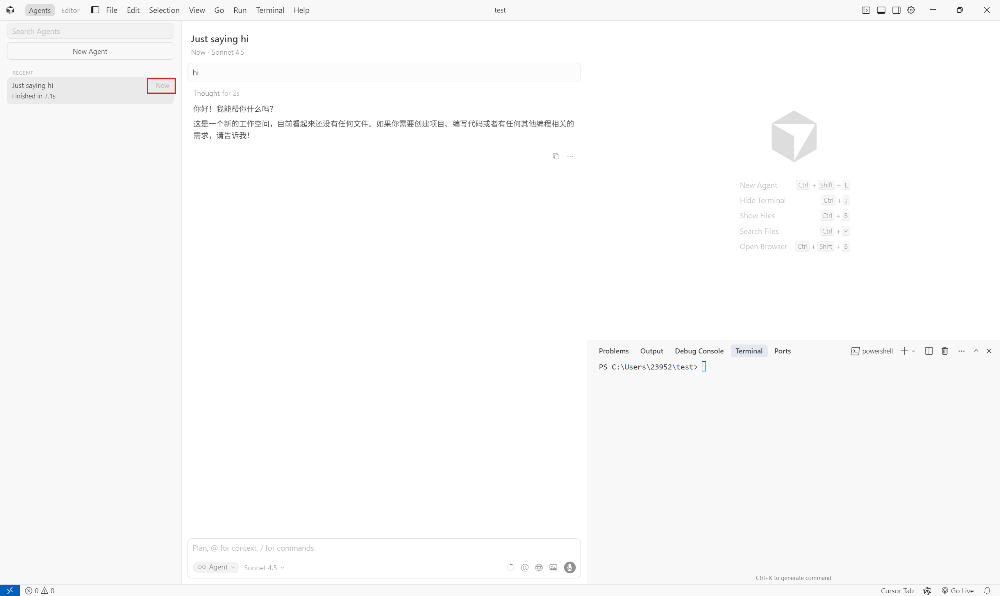
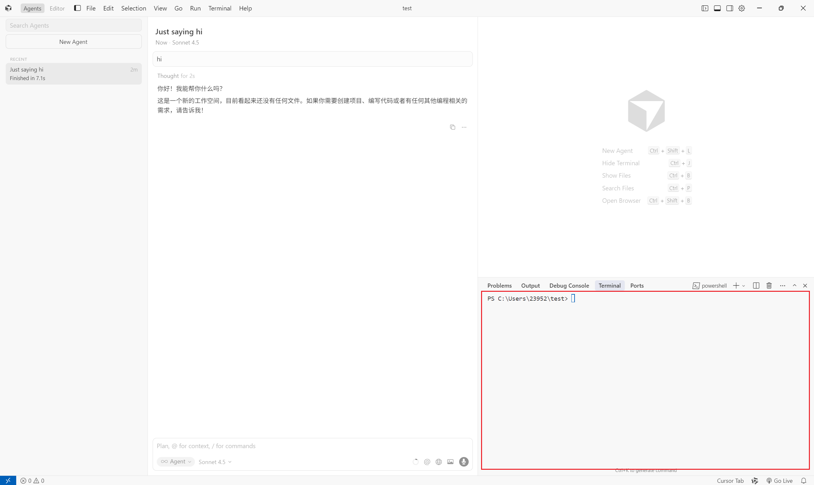
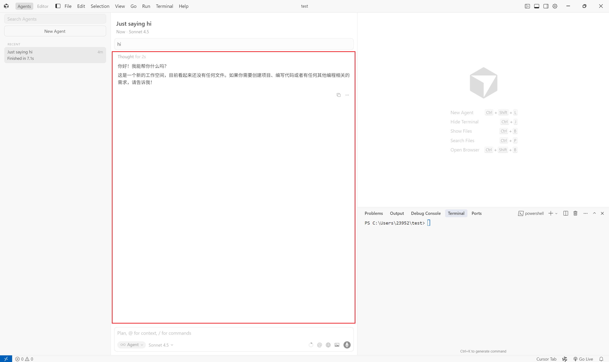

# Auto-Cursor — A GUI-based Cursor Manipulator

https://github.com/user-attachments/assets/64d83431-2287-48e6-b202-f80cffe23cf7

[English](#english-version) | [中文](#中文版本)

## English Version

### Overview
Auto-Cursor is a GUI-native orchestration layer that pilots the Cursor IDE like a human operator. By combining large language models, visual grounding, and deterministic automation, the project explores how agents can build software without being confined to command-line tooling.

### Why Through GUI?
1. **Human-parity reach**: Command-line automation is capped by the APIs that tools expose. A GUI agent, however, can click, type, drag, and navigate any surface that a human can. This dramatically widens the solution space—if a person can operate it, an agent can learn to operate it too, opening the door to automating entire product lifecycles.
2. **Grounded perception is ready**: Domain-specific MLLMs now recognize icons, layouts, and context with far higher reliability. The bottleneck has shifted from perception to orchestration. Auto-Cursor focuses on that orchestration layer—sequencing vision, language, and action—to unlock richer, end-to-end workflows.
3. **Standing on the shoulders of the ecosystem**: GUI-first control leverages advances in agents, LLMs, GPU-accelerated rendering, and even display hardware. We treat the modern desktop as a programmable environment, turning existing tools into improvable building blocks instead of rewriting them.

### Vision
1. **Build a resilient, self-improving system** that can iterate on its own behaviors, learn from failures, and adapt to different project constraints.
2. **Provide tangible GUI agent scenarios** that inspire new ideas for downstream industries—design, ops, education, assistive tech, and beyond.
3. **Stimulate thinking on AI safety and software design**, showing how oversight, logging, and guardrails can coexist with highly capable automation.

### Key Features
- Multi-round self-iteration orchestrated by `workflow()`.
- Vision-language reasoning via Gemini to understand screenshots and extract summaries/tests.
- Prompt refinement through OpenAI-compatible LLMs to keep Cursor on track.
- Configurable screen regions so the agent can adapt to any monitor arrangement.
- Structured logging for reproducibility (`outputs/workflow_<timestamp>.log`).

### Architecture at a Glance
1. Generate a Cursor-friendly initial prompt from your task description.
2. Send the prompt to Cursor through GUI interactions.
3. Wait until Cursor finishes (timestamp detection) and capture outputs via screenshots.
4. Extract summaries, tests, and terminal results with Gemini.
5. Decide whether to continue, refine the prompt, and iterate up to the configured maximum rounds.

### Getting Started
#### Requirements
- Python 3.9+
- Windows/macOS/Linux desktop with Cursor IDE installed
- LLM provider key: OpenAI, OpenRouter, or Gemini
- A stable display layout (avoid moving the Cursor window while running the workflow)

#### Installation
```bash
git clone https://github.com/<your-username>/Auto-Cursor.git
cd Auto-Cursor
python -m venv .venv
.venv\Scripts\activate  # Windows
source .venv/bin/activate  # macOS / Linux
pip install -r requirements.txt
```

#### Configure API Access
Create a `.env` file at the repository root and set the keys you plan to use:
```env
OPENAI_API_KEY=...
OPENAI_API_BASE=... # Optional
GEMINI_API_KEY=...
GEMINI_API_BASE=... # Optional
```


### Configuring Screen Regions
Auto-Cursor relies on precise pixel regions defined in `config.yaml`. Each region captures a specific UI component:
- `timestamp_region`: detects when Cursor stops responding.

!
- `terminal_region`: collects CLI outputs for inspection.

!
- `cursor_region`: reads Cursor’s chat summary and 
unit-test prompts.

!

Follow the steps below to tailor the regions to your own setup.

#### 1. Understand the Coordinate System
- Coordinates start from the top-left corner of your primary monitor `(0, 0)`.
- `x` and `y` denote the top-left point of the rectangle.
- `width` and `height` define the capture size in pixels.
- Multi-monitor setups continue the coordinate plane horizontally (e.g., a right-hand monitor starts at `x = primary_width`).

#### 2. Measure Coordinates
Option A — **Built-in script**:
```python
import pyautogui
print(pyautogui.position())  # Move your mouse to the desired corner and read the values
```

Option B — **Command-line overlay**:
```bash
python -m pyautogui
```
This opens a real-time overlay showing current coordinates and pixel colors.

Option C — **Screenshot tools**: Snipping Tool (Windows), Screenshot (macOS), or Flameshot (Linux) allow you to drag a rectangle and read width/height values directly.

#### 3. Capture Each Region
1. Arrange the Cursor IDE and terminal exactly as they will remain during automation.
2. For the timestamp area (usually the Cursor chat header), record its top-left coordinates and dimensions.
3. Repeat for the terminal window and the main Cursor chat panel.
4. Update `config.yaml` accordingly:
```yaml
timestamp_region:
  x: 340
  y: 160
  width: 80
  height: 20
terminal_region:
  x: 2050
  y: 875
  width: 450
  height: 625
cursor_region:
  x: 450
  y: 50
  width: 970
  height: 1180
```
5. Save a backup of your coordinates in case you change monitors or window layouts.

#### 4. Validate the Regions
- Run a dry test: `python main.py -i "echo 'hello world'" -d 10 -r 1`.
- Watch the screenshots saved in `statics/` to confirm that each capture is centered on the intended UI area.
- Adjust offsets by ±10 pixels if an area is clipped or misaligned.

### Running the Workflow
1. Launch Cursor and open the target project.
2. Ensure the terminal is visible and scrollback is clear.
3. Activate your virtual environment.
4. Run:
   ```bash
   python main.py --input "Build a Flask todo app" --delay 5 --max-rounds 5
   ```
5. Do not move the mouse or windows while the automation is in progress. Logs stream to the console and to `outputs/workflow_<timestamp>.log`.

### Troubleshooting & Tips
- **Mouse jumps unexpectedly**: Increase `--delay` to give yourself time to position the windows.
- **Gemini extraction fails**: Confirm API keys and network access; screenshots live in `statics/` for manual review.
- **Cursor chat input out of view**: Re-measure `cursor_region` and check that your display scaling is set to 100% or note the scaling factor in coordinates.
- **Multi-monitor setups**: Keep Cursor and terminal on the same monitor to avoid negative coordinates.

### Contributing & Community
- Read `CONTRIBUTING.md` for development workflow guidance.

### License
Auto-Cursor is released under the MIT License. See `LICENSE` for details.

---

## 中文版本

### 项目概览
Auto-Cursor 是一个 GUI 原生的“人机协同层”，它像真人一样操作 Cursor IDE。通过结合大语言模型、视觉识别与确定性自动化，该项目探索如何在不依赖命令行工具的情况下，让智能体完成真实的软件开发任务。

### 为什么选择 GUI？
1. **突破 CLI 上限**：命令行自动化受限于各工具暴露的接口，而 GUI 智能体可以点击、输入、拖拽并导航任何界面。只要人能操作的地方，智能体也能学会操作，从而拓展出几乎无限的解决空间。
2. **多模态能力已成熟**：垂直领域 MLLM 的图像理解与定位精度大幅提升，瓶颈已从“看得懂”转移到“如何统筹行动”。Auto-Cursor 聚焦于 orchestrator 层，把视觉、语言与动作串联起来，释放端到端工作流的潜力。
3. **借力整个生态**：GUI 驱动的控制方式站在智能体、LLM、GPU 渲染乃至显示硬件的肩膀上，将现有桌面环境视作可编程基座，把成熟软件转化为可复用的积木，而非从零重写。

### 愿景
1. **打造稳健且可自我迭代的系统**，能够随着任务与场景的变化不断优化自身行为。
2. **提供 GUI 智能体的真实应用场景**，激发大家对设计、运维、教育、无障碍等垂直领域的想象力。
3. **为 AI 安全与软件设计理念提供思考素材**，展示如何在强大自动化与可控性之间取得平衡。

### 核心特性
- `workflow()` 驱动的多轮自迭代逻辑。
- 借助 Gemini 从截图中提取摘要与测试脚本的视觉语言推理。
- 通过 OpenAI 兼容模型实时优化提示词，确保 Cursor 持续朝目标前进。
- 可配置的屏幕区域，适配不同分辨率与多屏布局。
- 全程结构化日志，便于复现与审计（`outputs/workflow_<timestamp>.log`）。

### 架构速览
1. 根据用户任务生成适配 Cursor 的初始提示词。
2. 通过 GUI 操作把提示词发送给 Cursor。
3. 截取时间戳、终端、对话区域，判断当前循环是否结束。
4. 交给 Gemini 分析截图，提炼摘要、测试脚本与终端输出。
5. 依据分析结果决定是否继续迭代，最多执行配置中允许的轮数。

### 环境准备
#### 基本要求
- Python 3.9 及以上版本
- 安装好 Cursor IDE 的 Windows/macOS/Linux 桌面环境
- 至少一个可用的 LLM 服务密钥（OpenAI / OpenRouter / Gemini）
- 稳定的窗口布局（运行期间不要移动窗口或调整缩放）

#### 安装步骤
```bash
git clone https://github.com/<your-username>/Auto-Cursor.git
cd Auto-Cursor
python -m venv .venv
.venv\Scripts\activate  # Windows
source .venv/bin/activate  # macOS / Linux
pip install -r requirements.txt
mkdir statics
mkdir outputs  # 若目录不存在请先创建截图与日志文件夹
```

#### 配置 API 访问
在仓库根目录创建 `.env` 文件，写入你准备使用的密钥：
```env
OPENAI_API_KEY=...
OPENAI_API_BASE=... # 可选
GEMINI_API_KEY=...
GEMINI_API_BASE=... # 可选
```

### REGION 配置详解
`config.yaml` 中的三个区域决定了截屏与自动化的准确性：
- `timestamp_region`：判断 Cursor 是否完成当前步骤。

!
- `terminal_region`：读取终端输出来评估测试结果。

!
- `cursor_region`：解析 Cursor 对话中的摘要与单测脚本。

!

#### 1. 坐标系认识
- 主显示器左上角为 `(0, 0)`。
- `x, y` 为矩形左上角坐标，`width, height` 为宽高。
- 多显示器横向拼接，右侧屏幕的 `x` 需要加上左侧屏幕宽度。

#### 2. 坐标测量方法
方式 A — **运行脚本**：
```python
import pyautogui
print(pyautogui.position())
```
移动鼠标到目标位置，读取输出。

方式 B — **命令行坐标叠加**：
```bash
python -m pyautogui
```
实时显示当前鼠标坐标与像素颜色。

方式 C — **截图工具**：Windows 截图工具、macOS Screenshot、Linux Flameshot 等均可直接显示选择区域的大小。

#### 3. 针对每个区域记录坐标
1. 把 Cursor 编辑器与终端摆放到最终布局。
2. 记录时间戳位置（通常是对话顶部的时间显示）。
3. 记录终端窗口与 Cursor 对话区域的左上角坐标和宽高。
4. 将数据填入 `config.yaml`：
```yaml
timestamp_region:
  x: 340
  y: 160
  width: 80
  height: 20
terminal_region:
  x: 2050
  y: 875
  width: 450
  height: 625
cursor_region:
  x: 450
  y: 50
  width: 970
  height: 1180
```
5. 建议备份一份配置，方便不同显示器之间切换。

#### 4. 验证配置
- 运行一次测试命令：`python main.py -i "echo 'hello world'" -d 10 -r 1`。
- 查看 `statics/` 目录下的截图，确认三个区域均覆盖了正确位置。
- 若偏差较大，可每次调整 10 像素重新验证。

### 执行流程
1. 打开 Cursor，并载入目标项目。
2. 确认终端窗口可见且输出清理完毕。
3. 激活虚拟环境。
4. 执行：
   ```bash
   python main.py --input "构建一个 Flask 待办应用" --delay 5 --max-rounds 5
   ```
5. 运行过程中请勿移动鼠标或改变窗口位置。日志会同时输出到控制台和 `outputs/workflow_<timestamp>.log`。

### 常见问题与排查
- **鼠标乱跳**：适当增大 `--delay`，留出窗口切换时间。
- **Gemini 提取失败**：检查密钥、网络状况，并在 `statics/` 查看原始截图。
- **输入框被遮挡**：重新测量 `cursor_region`，或把屏幕缩放调整为 100%。
- **多屏问题**：建议把 Cursor 与终端放在同一块屏幕，避免出现负坐标。

### 社区与协作
- 开发指南参考 `CONTRIBUTING.md`。
- 请遵守 `CODE_OF_CONDUCT.md` 共建友好社区。
- 安全问题请按照 `SECURITY.md` 中的流程私下反馈。

### 许可证
项目以 MIT License 开源，详见 `LICENSE`。
